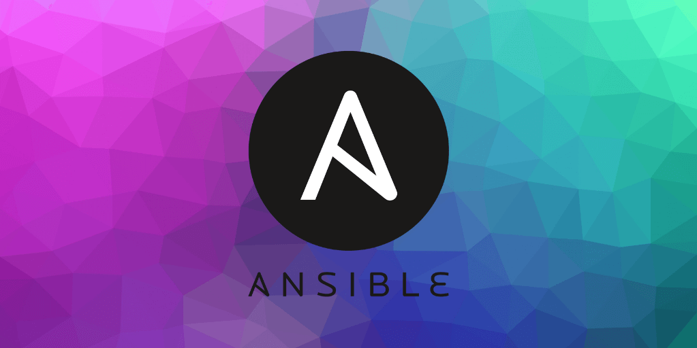

# MacOS Development Setup with Ansible

This playbook installs and configures a Mac for software development.

## Getting Started

There's a simple shell script in `bin/bootstrap` which will perform the initial steps of:

1. Installing Xcode
2. Installing Homebrew
3. Fetching required Ansible roles and collections

And then runs the main playbook `default.config.yaml`.

For future updates, `bin/apply` can be used to run just the Ansible playbook without the setup commands.

## Customisation

Everything can be customised by editing `default.config.yaml`. Alternatively, defining a custom `config.yaml` will overwrite default configuration.
